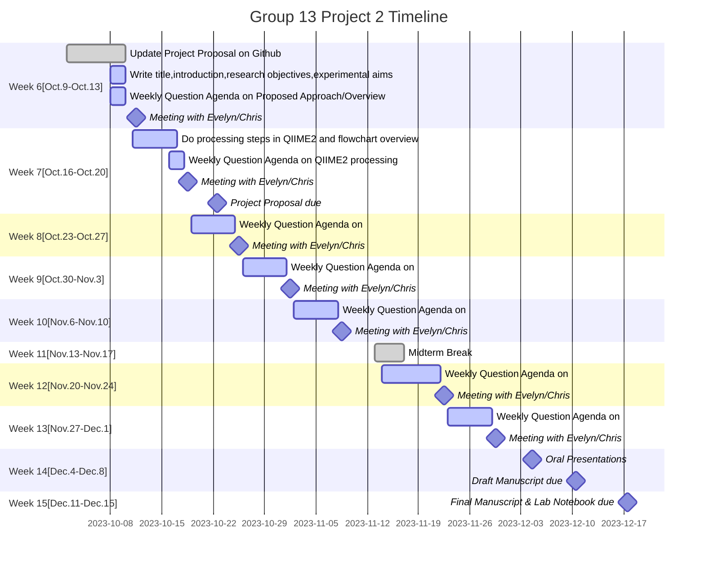

# MICB475_Group13
### authors: Juliet Malkowski, Lina Anwari, Abigail Cho, Màiri MacAulay, Betty Hong

# Project Proposal
### Proposed title: 
-often reflects the overarching goal of your project

### Introduction and Background: 
-provides the premise for why/how your dataset was collected in addition to an overview of the studies that have already been conducted on your dataset or relevant to your dataset (consider what you presented for your P2 review oral presentation)

### Research Objectives: 
-explains the areas of interest that you wish to pursue including specific research questions and corresponding hypotheses

### Experimental Aims and Rationale: 
-list of aims that your team hopes to achieve in order to address your research objectives and briefly describes how each aim will help achieve the research objectives

### Proposed Approach: 
-tabular summary of the purpose and proposed approach for each experimental aim

| AIM 1A: Does sheet washing frequency impact skin microbial composition? | AIM 1B: Does shower recency impact skin microbial composition? | AIM 2: Do gender differences in hygiene practices impact skin microbial composition? | AIM 3: Does time spent outside impact skin microbial composition in conjunction with hygiene practices?|
|---|---|---|---|
|1A-1: Edit metadata document to divide sheet washing frequency into high/low|1B-1: Edit metadata document to divide last shower day into recent/not recent|2-1: Import and demultiplex raw sequence reads|3-1: Edit metadata document to divide hours outside into high/low 
|1A-2: Import and demultiplex raw sequence reads (demux.qza)|1B-2: Import and demultiplex raw sequence reads|2-2: Perform sequence quality control and generate a feature table (table.qza)|3-2: Import and demultiplex raw sequence reads|
|1A-3: Perform sequence quality control and generate a feature table (table.qza)|1B-3: Perform sequence quality control and generate a feature table (table.qza)|2-3: Filter metadata by gender|3-3: Perform sequence quality control and generate a feature table (table.qza)|
|1A-4: Filter metadata for only samples that contain a value for sheet washing frequency|1B-4: Filter metadata for only samples that contain a value for shower recency|2-4: Filter metadata for samples that contain a value for either sheet washing frequency or shower recency|3-4: Filter metadata for samples that have a value for time outside|
|1A-5: Generate a filtered table|1B-5: Generate a filtered table|2-5: Generate a filtered table|3-5: Filter metadata for samples that contain a value for either sheet washing frequency or shower recency|
|1A-6: Run alpha and beta diversity metrics and analyze for interesting results|1B-6: Run alpha and beta diversity metrics and analyze for interesting results|2-6: Run alpha and beta diversity metrics and analyze for interesting results|3-6: Generate a filtered table|1A-7: Run taxonomic analysis to determine strain differences between groups (generate taxonomic bar blot)|1B-7: Run taxonomic analysis to determine strain differences between groups (generate taxonomic bar blot)|2-7: Run taxonomic analysis to determine strain differences between groups (generate taxonomic bar blot)|3-7: Run alpha and beta diversity metrics and analyze for interesting results|
|1A-7: Run taxonomic analysis to determine strain differences between groups (generate taxonomic bar blot)|1B-7: Run taxonomic analysis to determine strain differences between groups (generate taxonomic bar blot)|2-7: Run taxonomic analysis to determine strain differences between groups (generate taxonomic bar blot)|3-7: Run alpha and beta diversity metrics and analyze for interesting results|
|1A-8: Filter to remove unwanted ASVs|1B-8: Filter to remove unwanted ASVs|2-8: Filter to remove unwanted ASVs|3-8: Run taxonomic analysis to determine strain differences between groups (generate taxonomic bar blot)|
|1A-9: Export data and perform statistical analysis on alpha and/or beta diversity metrics and/or differential abundance testing for taxonomic metrics using R|1B-9: Export data and perform statistical analysis on alpha and/or beta diversity metrics and/or differential abundance testing for taxonomic metrics using R|2-9: Export data and perform statistical analysis on alpha and/or beta diversity metrics and/or differential abundance testing for taxonomic metrics using R|3-9: Filter to remove unwanted ASVs|
||||3-10: Export data and perform statistical analysis on alpha and/or beta diversity metrics and/or differential abundance testing for taxonomic metrics using R|

- I'll put in the names of the actual columns/groups we make
- and I can make what alpha/beta diversity metrics we choose more specific

### Overview Flowchart: 
-visual representation of research objectives or questions, corresponding experimental aims, and corresponding analysis/approach.

### Weekly Timeframe:

### Dataset Overview: 
-In order to complete this section, you will need to complete the processing steps in QIIME2 (up until the rarefaction curve) to extract the following information and describe your dataset. Please use this checklist Download checklistto ensure you describe these elements within your proposal and include the summary table and 2 figures listed in the checklist. 

### Participation Report:
-A breakdown of each team member’s contribution to preparing the proposal
Juliet: coded weekly timeframe

### References:
-follow ASM referencing guidelinesLinks to an external site.

1- mermaid r diagram to use for weekly timeline: https://mermaid.js.org/ 
