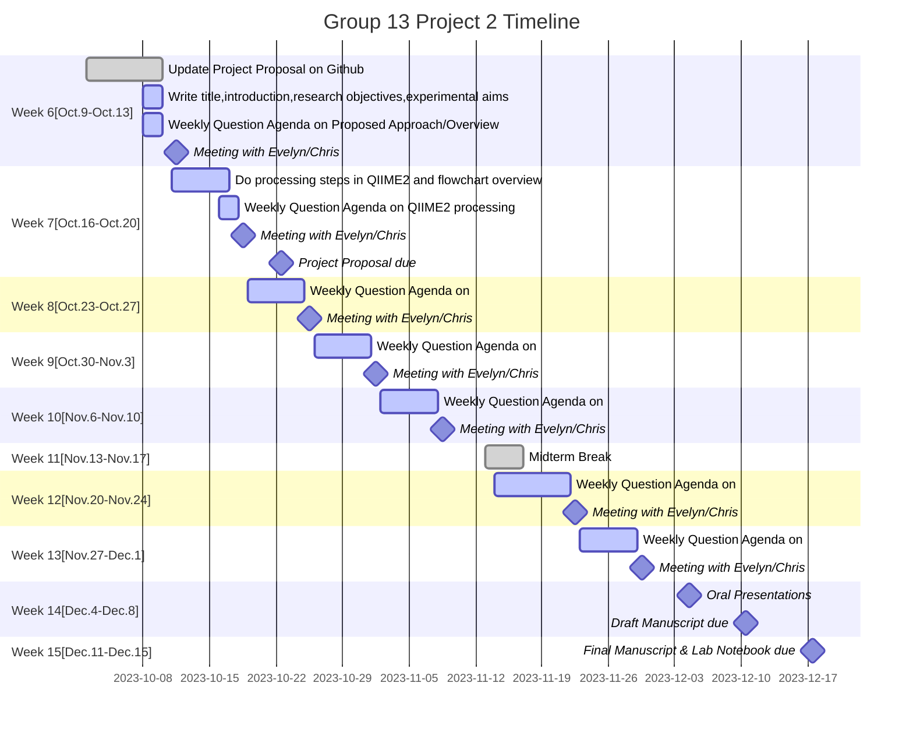

# MICB475_Group13
### Authors: Juliet Malkowski, Lina Anwari, Abigail Cho, Màiri MacAulay, Betty Hong

# Project Proposal
### Proposed title: 
Investigating the Impact of Hygiene Practice on Skin Microbial Composition of Individuals Residing in Shared Housing

### Introduction and Background: 
	Hygiene practices have historically been associated with lowering microbial concentrations on the skin to reduce the transmission of diseases (1). Skin is the largest organ in the human body and the microbial communities found on each individual are unique as they depend on many factors. Some of the most influential are the age, sex, health, hygiene habits, lifestyle, and environment of the host (2). Research has shown that skin samples in cohabiting individuals are more likely to share a similar microbial community (3), however fewer studies have researched how hygiene factors are associated with the hand microbiome (4).
The hand microbiome, especially in the epidermis layer of the dominant hand, is a unique site as it has frequent and direct interactions with the surrounding environment (2). Different areas of the body contain their own unique microbial compositions as the human body contains areas with different levels of humidity and sebaceous glands (5, 6). The dominant hand was shown to contain similar levels of diversity as the nondominant hand, however a significantly different composition was noted (2). This difference in composition is most likely due to skin genetics or the dominant hand contacting more environmental surfaces.
	In our study, we will be looking at two hygiene practices: sheet washing and showering. According to the Canadian Center for Occupational Health and Safety, frequent hand washing and washing linens are two actions recommended to reduce the spread of disease. Frequent hand washing has been determined to lower pathogenic transmission, as it lowers the number of microbes present on the palm (2). While less information is available about the direct effects of our two hygiene practices, we will be investigating their similarities to hand washing. 
	Genetics play a large part in determining hand microbial diversity, as women have shown to consistently contain a higher microbial diversity than men (2). The genetic differences between male and female skin include skin thickness, number of hairs, sweat, sebaceous glands and sex hormones which contribute to forming the microbial environment (7). Gender may also play a role in a social context, as a study has shown that worldwide women tend to adhere to hygiene practices more strictly than men (8). The role of gender will be examined in our study as a influencing factor on hand microbial composition. 
While hygiene practices reduce the overall microbial load that would be transmitted to the host hand, environmental factors change the microbial composition of the host hand (6). One study found that the microbial richness and phylogenetic diversity increases after spending time outside and becomes more similar to soil microbiota (8). Another study saw the composition of skin samples be primarily influenced by the host environment after comparing skin samples from individuals living in rural and urban areas (6). The influence of outdoor time on microbial diversity can be seen in a study that tested the skin microbial composition of school children who were exposed to either a classroom or biodiverse forest environment. Results from the study showed the influence of playing in the forest environment created higher microbial diversity than the classroom setting (9). With this past research in mind, our group aims to analyze the effect of hygiene practices on hand microbial diversity while considering potentially higher microbial diversity for individuals who spend more time outside. 
To better understand how the microbial environment of a shared space is affected by various living habits, Richardson et. al. collected personal samples from 37 participants in dorm rooms at the University of Chicago. Samples were collected with four time points over the course of 3 months. Skin samples of individuals were collected from their dominant hand by swabbing a sterile cotton BD-Swube applicator while sampling kits were given to participants for self-sampling with instructions. We will be assuming all students sampled are of similar age.
 Past research by students at the University of British Columbia has investigated the impact of roommates on an individual’s microbiome and the abiotic environment of the shared space. Their findings showed significant differences in the abiotic samples between single and multiple occupancy dorms (3). To provide further information about the microbial communities of a shared space, our group aims to expand on their findings with respect to hygiene practices and its impact on biotic microbial composition. There are currently few studies conducted on the effects of hygiene practices other than handwashing on skin microbial composition. A knowledge gap our group aims to address is the effect of two other hygiene practices, sheet washing and showering, on the hand microbiome. 
	While the microbial community composition on the human skin is largely determined by genetics, the two most influential factors that are within human control are hygiene practices and lifestyle type. Our group aims to investigate two hygiene practices to see if either have a positive influence on the health of microbial community composition on the human skin, as better hygiene practices can easily be added into most individuals' daily routine and can prevent the spread of pathogenic diseases (9).

### Research Objectives: 
The overall aim of our study is to explore the impact different hygiene practices have on the microbial diversity present on the skin of  individuals residing in dorms. Due to the lack of research in this area and the fact that residing in a shared dormitory is a common experience for a significant portion of the population, it is relevant to investigate potential hygiene practices that can lead to fostering healthier lifestyles. This study can further propose recommendations for improved hygiene habits that can enhance the overall health of those sharing the dormitories.
To investigate the impact cleanliness has on the microbes residing on skin, we aim to explore if differences in hygiene practices such as the frequency of showers, and washing of bed sheets will affect skin microbial composition. According to literature, microbial diversity has been undergoing decades-long decrease due to humans adapting to more urbanized living (10). This lifestyle includes intensified hygiene practices of bodies, workplaces, and homes which plays a role in the observed homogeneity. Therefore, we hypothesize that if there are variations in hygiene practices among individuals, then skin microbial composition will either increase or decrease in diversity as a result of less or more hygiene respectively. 
Our second aim is to investigate if variation in hygiene practices of different genders (male/female) can potentially impact skin microbial composition. To ensure we are looking at all aspects that can affect skin microbiome, it is important to look at the potential influence gender may have on the data obtained based on hygiene practices. Previous research focusing on hand surfaces of females and males suggest that females show higher species diversity than males because they have thinner skin, lower pH, less intense sweat production, and different sex hormones (11). Therefore, we hypothesize that variation in gender will result in different types and amounts of microbes present on skin in relation to hygiene practices. Literature supports this hypothesis as it shows that female skin has significantly more Enterobacterales and Lactobacillaceae, and men tend to have higher concentrations of Cutibacterium and Corynebacterium, thus indicating a difference in the microbial composition between the two genders (7). 
Microbes present in our surrounding environment play a significant role in maintaining good health, making it relevant to explore how different environmental exposure can affect skin microbial composition. In this study, we will further explore the effects that outdoor exposure can have on microbial skin composition of those living in dorms. Ecological health and biodiversity of the environment surrounding us - and how we interact with it plays a significant role in the biodiversity seen on the human microbiome (12). Therefore, if there are variations in the amount of time individuals are outside, then an increase or decrease in skin microbial diversity will be detected as a result of spending more or less time outside respectively. 

### Experimental Aims and Rationale: 
1A.  Does sheet washing frequency impact skin microbial composition?

Our first aim is to determine whether sheet washing frequency impacts the microbial composition from skin samples of individuals. Existing studies show that microbial composition of fabrics is influenced by washing and drying and that contact with the skin has the potential for these microorganisms to be transferred from the fabrics to the skin (7). For example, microorganisms that can use dirt or sebum compounds as substrates to produce volatile substances have the potential to be transferred to the skin, which contributes to unpleasant odors (7). The skin, particularly the hand, comes into contact with many environmental surfaces and transmission of microorganisms can occur (2). To address our main objective of exploring whether personal hygiene practices influence the skin microbial composition, we will be investigating whether different sheet washing frequencies will affect the microbial composition and diversity of the skin. Samples will be categorized into groups based on the distribution of our samples into high, medium, and low sheet washing frequency. Both alpha and beta diversity analyses will be conducted to determine if there are significant differences in microbial composition within and between the groups. Additionally, taxonomic bar plots will be generated to provide a visualization of relative abundance at the genus and phylum levels between different sheet washing frequencies to provide information about general changes in microbial composition. Differential Expression Sequence Analysis (DESeq) will also be performed to identify differentially abundant taxa between different sheet washing frequency groups. 

1B. Does shower recency impact skin microbial composition?

In addition to sheet washing frequency, shower recency is another personal hygiene practice that will be investigated to determine whether this factor affects the microbial composition of an individual’s skin. Hygiene practices are known to be associated with promoting health and preventing disease but can also potentially result in a loss of microbial diversity or microbial acquisition (7). Additionally, previous literature suggests that proper hand hygiene practices were significantly correlated with differences in bacterial composition (1). Hand hygiene reduced bacterial diversity on the hands and the time since last handwashing was significantly correlated with changes in the bacterial composition but did not affect bacterial diversity (1). This suggests that while the specific composition of bacteria may shift, the overall level of diversity does not change with time since last handwashing (1). The goal of this research question is to determine the degree at which the time since an individual’s last shower influences the composition of the skin microbiome to address our objective of determining whether personal hygiene practices influence the skin microbial composition and to identify the changes in microbial composition based on shower recency. To achieve this, samples will be categorized into “recent” or “not recent” groups based on the distribution of our samples, followed by conducting both alpha and beta diversity analyses to identify significant differences within and between each group. Taxonomic bar plots will be generated to provide a visualization of the microbial composition of “recent” and “not-recent” shower groups which will allow us to identify general microbial changes based on the relative abundance at the phylum and genus levels and DESeq analysis will be performed to identify differentially abundant taxa based on shower recency groups. 

2. Does gender impact skin microbial composition in conjunction with hygiene practices?
Does gender impact skin microbial composition in conjunction with sheet washing frequency?
Does gender impact skin microbial composition in conjunction with shower recency?

Our second aim is to determine whether the microbial composition of different genders will differ based on the hygiene analyses from aims 1A and 1B. Previous studies show that there are significant differences in skin microbial composition depending on gender which may result from various sex-specific physical properties of the skin (7). This study also shows that the female skin microbiome is shown to have higher species diversity (7). Our analyses intend to further investigate whether differences in hygiene practices (shower recency and sheet washing frequency) have differing effects on skin microbial composition between sex-specific groups. To address this aim, alpha and beta diversity analyses will be conducted to identify significant differences between males and females based on their hygiene groupings set in aim 1A and 1B. Taxonomic bar plots will be generated at the genus and phylum levels to visualize the relative abundance and identify general microbial changes between different genders and hygiene practice groupings and DESeq analysis will additionally be conducted to identify differentially abundant taxa between these groups. 

3.  Do differences in time spent outside impact skin microbial composition in conjunction with hygiene practices?
Do differences in time spent outside impact skin microbial composition in conjunction with sheet washing frequency?
Do differences in time spent outside  impact skin microbial composition in conjunction with shower recency?

In addition to personal hygiene practices, exposure to different environments have an effect on the microbial composition of the skin depending on the hours spent outside of an individual. Previous studies show that urban and rural residents have differing microbial compositions on the basis that urban residents tend to spend more time indoors compared to rural residents, resulting in lower microbial diversity (7). Our fourth aim is to determine whether differences in the amount of time spent outside impacts the microbial composition of the skin in conjunction with personal hygiene practices (sheet washing frequency and shower recency). To address this aim, microbial composition of the different groups will be characterized to the genus and phylum level by generating taxonomic bar plots which will allow us to identify general microbial changes based on time spent outside and hygiene practices (sheet washing frequency and shower recency). Additionally, alpha and beta diversity analyses will be performed to determine if there are significant differences in microbial diversity and composition and DESeq analysis to determine differentially abundant taxa based on the amount of time an individual spends outside and their hygiene practice habits (sheet washing frequency and shower recency). 

### Proposed Approach: 
- tabular summary of the purpose and proposed approach for each experimental aim

- I'll put in the where we will split hours outside
- I'll make what alpha/beta diversity metrics we choose more specific
- I'll add making a PCOA plot and Deseq2 (plot as a bar plot)

### Overview Flowchart: 
- visual representation of research objectives or questions, corresponding experimental aims, and corresponding analysis/approach.

### Weekly Timeframe:

### Dataset Overview: 
Richardson et al. published a paper that examined skin and environmental surfaces in a shared dorm. It provided a variety of information including metadata and manifest file which was used for this data processing step (13). From the QIIME2 server, the dorms dataset was imported and demultiplexed. From the demultiplexed file, we discovered a maximum read length of 151 nucleotides for our samples and more than 99% of the reads have the same length. 
Using DADA2, the demultiplexed dataset was denoised to remove low quality reads with 150 nucleotides truncation length and ASV (Amplicon Sequence Variants) were clustered (14). Table 1 summarizes the total sample size and the sequencing depth before and after denoising. The read quality plot shows a drop of the median quality score at position 151 which is shown in figure 1. We extracted the V4 regions of the 16s rRNA gene from the SILVA database and were targeted with a 515F-806RB primer pair with forward primer sequence of 5’ GTGCCAGCMGCCGCGGTAA 3’ and reverse primer sequence of 5’ GGACTACHVGGGTWTCTAAT 3’. We trained the classifier with the new rep-seq file and used the trained classifier to assign the taxonomy of our reads. Mitochondria and chloroplast sequences were removed and we filtered to keep only the skin (hand) samples. We only want to include skin samples and exclude the surface samples for our downstream analysis. 
Alpha rarefaction curve was generated using the skin filtered table and the rooted tree file. The sampling depth is set to 6223 where 653,415 (38.06%) features were obtained in 105 (92.11%) samples. The skin filtered dataset (from the table) was set to sampling depth of 6223 as at this depth, a majority of the samples and ASVs are retained. This is substantiated with an alpha rarefaction curve at sampling depth of ~6223 where the curve plateau. This suggests that the ASVs are saturated which is summarized in figure 2. In result, 9 samples are discarded at this rarefaction depth. 
 

### Participation Report:
	Juliet was responsible for researching and writing the introduction and background. Lina researched and wrote the research objectives. Abigail researched and wrote the experimental aims and their rationales. Màiri put together the proposed approach, overview flowchart, and gantt chart/weekly time table. Betty conducted the QIIME2 processing and the dataset overview. All members collaboratively problem-solved if they were uncertain or had questions about their designated section(s). All members contributed to formatting the final document and putting together references.

### References:
1. Vandegrift R, Bateman AC, Siemens KN, Nguyen M, Wilson HE, Green JL, Van Den Wymelenberg KG, Hickey RJ. 2017. Cleanliness in context: reconciling hygiene with a modern microbial perspective. Microbiome 5:76.
2. 	Fierer N, Hamady M, Lauber CL, Knight R. 2008. The influence of sex, handedness, and washing on the diversity of hand surface bacteria. Proc Natl Acad Sci U S A 105:17994–17999.
3. 	Luongo A, MacPherson K, Meloche C, Roberge S. 2022. Cohabitation impacts the microbial diversity and taxonomic makeup of the biotic and abiotic environments in a college dormitory. Undergraduate Journal of Experimental Microbiology and Immunology 27.
4. 	Edmonds-Wilson SL, Nurinova NI, Zapka CA, Fierer N, Wilson M. 2015. Review of human hand microbiome research. Journal of Dermatological Science 80:3–12.
5. 	Ying S, Zeng D-N, Chi L, Tan Y, Galzote C, Cardona C, Lax S, Gilbert J, Quan Z-X. 2015. The Influence of Age and Gender on Skin-Associated Microbial Communities in Urban and Rural Human Populations. PLOS ONE 10:e0141842.
6. 	Chen YE, Tsao H. 2013. The skin microbiome: current perspectives and future challenges. J Am Acad Dermatol 69:143-155.e3.
7. 	Skowron K, Bauza-Kaszewska J, Kraszewska Z, Wiktorczyk-Kapischke N, Grudlewska-Buda K, Kwiecińska-Piróg J, Wałecka-Zacharska E, Radtke L, Gospodarek-Komkowska E. 2021. Human Skin Microbiome: Impact of Intrinsic and Extrinsic Factors on Skin Microbiota. 3. Microorganisms 9:543.
8. 	Eriksson K, Dickins TE, Strimling P. 2022. Global sex differences in hygiene norms and their relation to sex equality. PLOS Global Public Health 2:e0000591.
9. 	Al-Rifaai JM, Al Haddad AM, Qasem JA. 2018. Personal hygiene among college students in Kuwait: A Health promotion perspective. J Educ Health Promot 7:92.
10. 	Okada H, Kuhn C, Feillet H, Bach J-F. 2010. The ‘hygiene hypothesis’ for autoimmune and allergic diseases: an update. Clin Exp Immunol 160:1–9.
11. 	Finlay BB, Amato KR, Azad M, Blaser MJ, Bosch TCG, Chu H, Dominguez-Bello MG, Ehrlich SD, Elinav E, Geva-Zatorsky N, Gros P, Guillemin K, Keck F, Korem T, McFall-Ngai MJ, Melby MK, Nichter M, Pettersson S, Poinar H, Rees T, Tropini C, Zhao L, Giles-Vernick T. 2021. The hygiene hypothesis, the COVID pandemic, and consequences for the human microbiome. Proc Natl Acad Sci U S A 118:e2010217118.
12. 	Prescott SL, Larcombe D-L, Logan AC, West C, Burks W, Caraballo L, Levin M, Etten EV, Horwitz P, Kozyrskyj A, Campbell DE. 2017. The skin microbiome: impact of modern environments on skin ecology, barrier integrity, and systemic immune programming. World Allergy Organ J 10:29.
13. 	Richardson M, Gottel N, Gilbert JA, Lax S. 2019. Microbial Similarity between Students in a Common Dormitory Environment Reveals the Forensic Potential of Individual Microbial Signatures. mBio 10:e01054-19.
14. 	Callahan BJ, McMurdie PJ, Rosen MJ, Han AW, Johnson AJA, Holmes SP. 2016. DADA2: High resolution sample inference from Illumina amplicon data. Nat Methods 13:581–583.

