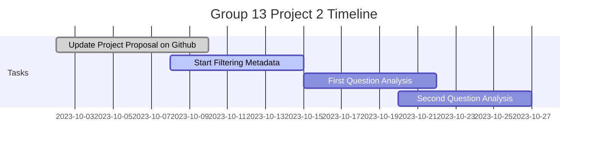

# MICB475_Group13
### authors: Juliet Malkowski, Lina Anwari, Abigail Cho

# Project Proposal
### Proposed title: 
-often reflects the overarching goal of your project

### Introduction and Background: 
-provides the premise for why/how your dataset was collected in addition to an overview of the studies that have already been conducted on your dataset or relevant to your dataset (consider what you presented for your P2 review oral presentation)

### Research Objectives: 
-explains the areas of interest that you wish to pursue including specific research questions and corresponding hypotheses

### Experimental Aims and Rationale: 
-list of aims that your team hopes to achieve in order to address your research objectives and briefly describes how each aim will help achieve the research objectives

### Proposed Approach: 
-tabular summary of the purpose and proposed approach for each experimental aim

### Overview Flowchart: 
-visual representation of research objectives or questions, corresponding experimental aims, and corresponding analysis/approach.

### Weekly Timeframe:

### Dataset Overview: 
-In order to complete this section, you will need to complete the processing steps in QIIME2 (up until the rarefaction curve) to extract the following information and describe your dataset. Please use this checklist Download checklistto ensure you describe these elements within your proposal and include the summary table and 2 figures listed in the checklist. 

### Participation Report:
-A breakdown of each team member’s contribution to preparing the proposal

### References:
-follow ASM referencing guidelinesLinks to an external site.
